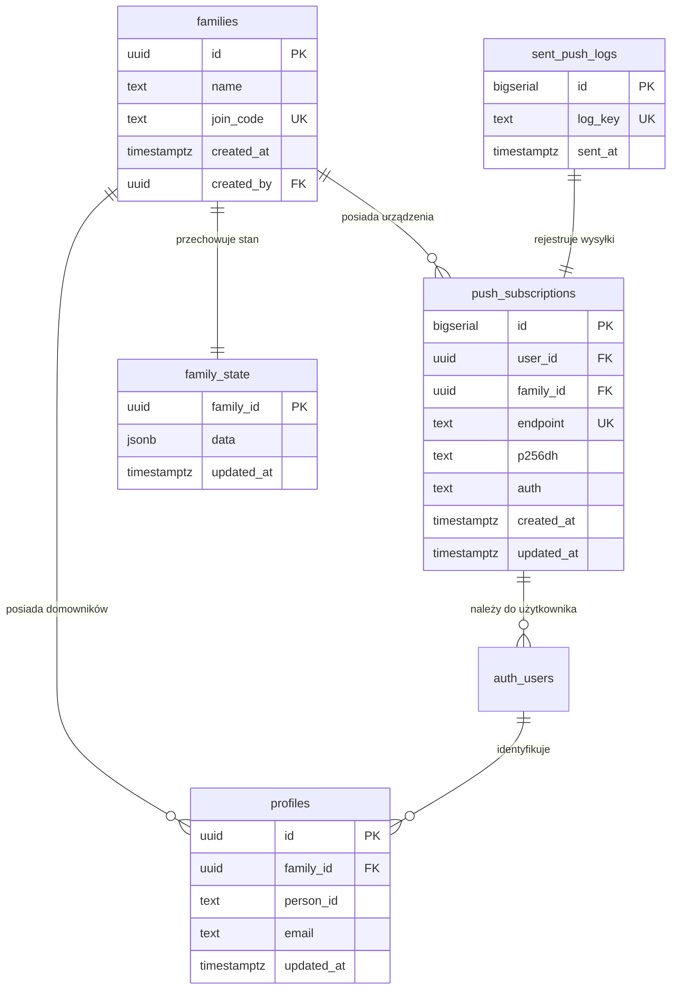
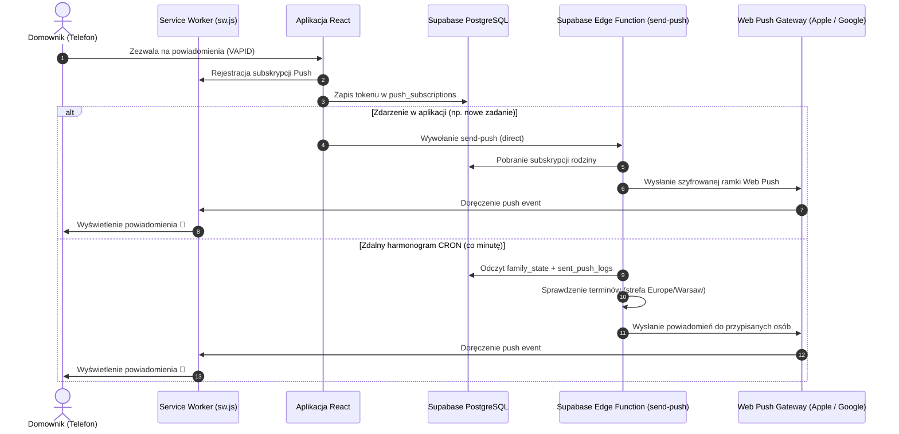

# Architektura i Dokumentacja Techniczna: Rodzinny Planer (v3.2.0)

Kompleksowa dokumentacja techniczna, architektoniczna oraz funkcjonalna aplikacji **Rodzinny Planer** – nowoczesnego, wieloplatformowego asystenta organizacji życia rodzinnego z synchronizacją czasu rzeczywistego (Realtime), zabezpieczeniami Row-Level Security (RLS) oraz powiadomieniami Web Push.

---

## 1. Przegląd Systemu (System Overview)

**Rodzinny Planer** to aplikacja internetowa klasy Progressive Web App (PWA) działająca w czasie rzeczywistym, zaprojektowana z myślą o ułatwieniu codziennej koordynacji obowiązków domowych, budżetu, kalendarza, wspólnych zakupów oraz komunikacji wewnątrz rodziny.

### Główne filary systemu:
- **Wspólna przestrzeń:** Scentralizowany punkt dostępu dla wszystkich domowników (rodzice, dzieci, współlokatorzy).
- **Czas rzeczywisty (Realtime):** Natychmiastowa synchronizacja zmian między urządzeniami wszystkich członków rodziny bez konieczności przeładowywania strony.
- **Wieloplatformowość (PWA & Web Push):** Dedykowany interfejs zoptymalizowany pod smartfony (iOS, Android) oraz komputery z pełną obsługą instalacji na ekranie głównym i powiadomień w tle.
- **Bezpieczeństwo i Izolacja:** Pełna izolacja danych grup rodzinnych z wykorzystaniem polityk **Row-Level Security (RLS)** w bazie PostgreSQL/Supabase.
- **Design System *Dark Obsidian*:** Ekskluzywna ciemna paleta kolorystyczna (`#121214`, `#1A1A1E`) z ciepłymi bursztynowo-złotymi (`#F59E0B`, `#FCD34D`) i szmaragdowymi (`#10B981`) akcentami.

---

## 2. Architektura Technologiczna (Tech Stack)

```
┌────────────────────────────────────────────────────────────────────────┐
│                        FRONTEND (React 19 + Vite)                      │
│   ┌──────────────┐  ┌──────────────┐  ┌──────────────┐  ┌────────────┐ │
│   │  TailwindCSS │  │ Lucide Icons │  │  PWA / SW.js │  │ Sharp/Icons│ │
│   └──────────────┘  └──────────────┘  └──────────────┘  └────────────┘ │
│   ┌──────────────────────────────────────────────────────────────────┐ │
│   │     Nawigacja 4+1 (Dziś, Kalendarz, Zadania, Notatki + Więcej)   │ │
│   └──────────────────────────────────────────────────────────────────┘ │
└───────────────────────────────────▲────────────────────────────────────┘
                                    │ HTTPS / WSS (WebSockets)
                                    ▼
┌────────────────────────────────────────────────────────────────────────┐
│                        BACKEND & BAZA (Supabase)                       │
│   ┌────────────────────────────────────────────────────────────────┐   │
│   │                      Supabase Auth (JWT)                       │   │
│   └────────────────────────────────────────────────────────────────┘   │
│   ┌─────────────────────────┐           ┌──────────────────────────┐   │
│   │  PostgreSQL (RLS, JSONB)│ ◄───────► │  Realtime Engine (WS)    │   │
│   │  Tabela: family_state   │           │  Kanał: realtime:public  │   │
│   └─────────────────────────┘           └──────────────────────────┘   │
│   ┌────────────────────────────────────────────────────────────────┐   │
│   │     Supabase Edge Functions (Deno.serve + web-push VAPID)      │   │
│   │     - Wysyłka Push, CRON minutowy, auto-czyszczenie 410/404    │   │
│   └────────────────────────────────────────────────────────────────┘   │
└───────────────────────────────────▲────────────────────────────────────┘
                                    │ Web Push Protocol (VAPID P-256)
                                    ▼
┌────────────────────────────────────────────────────────────────────────┐
│                    URZĄDZENIA KOŃCOWE (Android / iOS / PC)             │
│       Powiadomienia Push w tle, Badges PNG, Dźwięki i Wibracje         │
└────────────────────────────────────────────────────────────────────────┘
```

### Stos technologiczny:
- **Warstwa UI:** React 19, Vite, Tailwind CSS, Lucide React, TipTap Editor.
- **Zarządzanie stanem i cache:** React Hooks (`useCallback`, `useMemo`, `useRef`), optymistyczne aktualizacje UI, lokalny cache `sentReminderKeys` oraz Service Worker Cache.
- **Baza danych i autoryzacja:** Supabase (PostgreSQL 15+, Supabase Auth, Row-Level Security, Realtime Replication).
- **Silnik Web Push:** Service Worker (`public/sw.js`), Web Push API z certyfikowanymi kluczami **VAPID P-256 (NIST prime256v1)**.
- **Funkcje Serverless:** Supabase Edge Functions (`supabase_edge_function_send_push.ts`) oparte na natywnym `Deno.serve`.
- **Generowanie zasobów graficznych:** Node.js + `sharp` (`scripts/generate_icons.js`).

---

## 3. Schemat Bazy Danych i Bezpieczeństwo (RLS)

Model danych został zoptymalizowany pod kątem szybkości zapytań, integralności relacyjnej i pełnego bezpieczeństwa.



### 1. `families`
Główna tabela reprezentująca gospodarstwo domowe / grupę rodzinną.
- `id` (`UUID`, Primary Key, `gen_random_uuid()`)
- `name` (`TEXT`) – nazwa rodziny (np. *„Rodzina Kowalskich”*)
- `join_code` (`TEXT`, UNIQUE) – unikalny 6-znakowy kod dołączania nowych członków
- `created_at` (`TIMESTAMPTZ`)
- `created_by` (`UUID`, Foreign Key do `auth.users.id`)

### 2. `profiles`
Profile użytkowników łączące konta Supabase Auth z grupami rodzinnymi i fizycznymi osobami w aplikacji.
- `id` (`UUID`, Primary Key, Foreign Key do `auth.users.id`)
- `family_id` (`UUID`, Foreign Key do `families.id`)
- `person_id` (`TEXT`) – identyfikator przypisanego domownika (np. `p_123456`)
- `email` (`TEXT`) – adres e-mail konta
- `updated_at` (`TIMESTAMPTZ`)

### 3. `family_state`
Dokumentowa tabela przechowująca stan wszystkich modułów rodziny w strukturze `JSONB`:
- `family_id` (`UUID`, Primary Key, Foreign Key do `families.id`)
- `data` (`JSONB`) – kompletny stan rodziny:
  - `people` (`Array`) – lista domowników (id, imię, kolor, awatar, punkty),
  - `events` (`Array`) – wydarzenia w kalendarzu (daty, godziny, powtarzalność, przypisane osoby, przypomnienia),
  - `tasks` (`Array`) – zadania, checklisty, terminy, osoby odpowiedzialne,
  - `shopping` (`Array`) – wspólna lista zakupów z 9 kategoriami,
  - `budget` (`Object`) – słownik budżetów miesięcznych (`YYYY-MM`: dochody, koszty stałe, wydatki bieżące),
  - `budgetGoals` (`Array`) – cele oszczędnościowe kwotowe i otwarte (∞),
  - `notes` (`Array`) – notatki z formatowaniem TipTap,
  - `wall` (`Array`) – wiadomości i wpisy na tablicy (lodówce),
  - `settings` (`Object`) – konfiguracja aktywnych modułów,
  - `sentReminderKeys` (`Object`) – rejestr wyemitowanych przypomnień zapobiegający duplikatom.
- `updated_at` (`TIMESTAMPTZ`)

### 4. `push_subscriptions`
Kolekcja aktywnych tokenów subskrypcji Web Push dla telefonów i przeglądarek:
- `id` (`BIGSERIAL`, Primary Key)
- `user_id` (`UUID`, Foreign Key do `auth.users.id`)
- `family_id` (`UUID`, Foreign Key do `families.id`)
- `endpoint` (`TEXT`, UNIQUE) – unikalny adres URL serwera Web Push (FCM, Apple APNs, Mozilla)
- `p256dh` (`TEXT`) – klucz publiczny klienta
- `auth` (`TEXT`) – klucz autoryzacyjny
- `created_at` / `updated_at` (`TIMESTAMPTZ`)

### 5. `sent_push_logs`
Tabela logów zapobiegająca wielokrotnej wysyłce tego samego powiadomienia w oknie czasowym:
- `id` (`BIGSERIAL`, Primary Key)
- `log_key` (`TEXT`, UNIQUE) – unikalny klucz zdarzenia (np. `cron_ev_123_2026-09-08_1_09:00`)
- `sent_at` (`TIMESTAMPTZ`)

### Polityki Bezpieczeństwa (Row-Level Security):
Wszystkie tabele mają **włączone RLS**. Dostęp do danych jest zabezpieczony funkcją pomocniczą:
```sql
CREATE OR REPLACE FUNCTION public.get_current_user_family_id()
RETURNS UUID AS $$
  SELECT family_id FROM public.profiles WHERE id = auth.uid() LIMIT 1;
$$ LANGUAGE sql STABLE SECURITY DEFINER;
```
Użytkownik ma dostęp **wyłącznie** do rekordów powiązanych z jego `family_id`.

---

## 4. Architektura UI i Nawigacji (Układ 4+1)

W wersji 3.2.0 wdrożono zoptymalizowaną architekturę nawigacji mobilnej, zgodną z wytycznymi iOS Human Interface Guidelines i Material 3:

```
┌────────────────────────────────────────────────────────────────────────┐
│                        NAGŁÓWEK (Sticky Header)                        │
│   [Logo]  Nazwa Rodziny    [Chip Aktywnego Profilu]    [⚙ Ustawienia]  │
├────────────────────────────────────────────────────────────────────────┤
│                                                                        │
│                        GŁÓWNY OBSZAR ROBOCZY                           │
│     (Dziś / Kalendarz / Zadania / Notatki / Zakupy / Tablica / Budżet) │
│                                                                        │
│                                                [ + Pływający FAB ]     │
├────────────────────────────────────────────────────────────────────────┤
│                     DOLNY PASEK NAWIGACJI (4+1)                        │
│   ┌────────┐   ┌───────────┐   ┌─────────┐   ┌─────────┐   ┌────────┐  │
│   │ ⏰ Dziś │   │ 📅 Kalend.│   │ ✅Zadania│   │ 📝Notatki│   │ ⋯Więcej│  │
│   └────────┘   └───────────┘   └─────────┘   └─────────┘   └────┬───┘  │
└─────────────────────────────────────────────────────────────────┼──────┘
                                                                  │
                                      ┌───────────────────────────▼──────┐
                                      │   Wysuwany Arkusz (Bottom Sheet) │
                                      │   🛒 Wspólna Lista Zakupów (3)   │
                                      │   📌 Tablica Rodzinna (Lodówka)  │
                                      │   💰 Budżet i Cele Finansowe     │
                                      │   ⚙️ Ustawienia i Profile         │
                                      └──────────────────────────────────┘
```

### Podział modułów:
1. **Główny pasek dolny (zawsze widoczny pod kciukiem):**
   - ⏰ **Dziś (`today`):** Pulpit dnia, powitanie kontekstowe, podsumowanie agendy i szybki podgląd zakupów.
   - 📅 **Kalendarz (`calendar`):** Widok siatki miesiąca, wydarzenia per osoba z wielokolorowymi gradientami, czysty interfejs bez zduplikowanych przycisków (obsługa przez FAB).
   - ✅ **Zadania (`tasks`):** Zadania domowe, filtry domowników, cykle powtarzalności i punkty.
   - 📝 **Notatki (`notes`):** Podręczne notatki z edytorem TipTap, listami kontrolnymi i wyszukiwarką.
   - ⋯ **Więcej (`more`):** Przycisk otwierający nowoczesny arkusz Dark Obsidian z pozostałymi modułami oraz wskaźnikiem powiadomień.
2. **Moduły w arkuszu „Więcej” (`MoreMenuSheet`):**
   - 🛒 **Lista Zakupów (`shopping`):** Nowy moduł wspólnej listy zakupów z 9 kategoriami i licznikiem *"X do kupienia"*.
   - 📌 **Tablica (`wall`):** Wirtualne karteczki na lodówce, przypinanie ważnych wiadomości.
   - 💰 **Budżet (`budget`):** Limity miesięczne, historia transakcji z `inputMode="decimal"`, długoterminowe cele oszczędnościowe (kwotowe i bez limitu ∞).
   - ⚙️ **Ustawienia (`settings`):** Zarządzanie domownikami, uprawnienia Web Push, zmiana haseł, diagnostyka.

---

## 5. Szczegółowy Opis Modułów

### 5.1. Pulpit „Dziś” ([`TodayView.jsx`](file:///c:/Users/arcis/Projekty/rodzinny-planer/src/views/TodayView.jsx))
- **Kontekstowe Powitanie:** Dynamiczny nagłówek dopasowany do pory dnia i profilu (*„Dzień dobry, Aniu! ☀️”*, *„Dobry wieczór, Kuba! 🌙”*).
- **Zintegrowana Agenda:** Wydarzenia z kalendarza na dzisiejszy dzień posortowane chronologicznie.
- **Zadania i Zaległości:** Lista zadań na dziś wraz z wyróżnieniem zadań przeterminowanych.
- **Widżet Zakupów:** Klikalny kafelek z listą niekupionych produktów i przejściem do zakupów.
- **Przypięte wiadomości:** Wyróżnione wpisy z lodówki na samej górze.

### 5.2. Wspólna Lista Zakupów ([`ShoppingView.jsx`](file:///c:/Users/arcis/Projekty/rodzinny-planer/src/views/ShoppingView.jsx))
- **9 Intuicyjnych Kategorii:** Warzywa i owoce, Pieczywo, Nabiał, Mięso i ryby, Napoje, Przekąski i słodycze, Chemia i dom, Kosmetyki i higiena, Inne.
- **Inteligentne Auto-dopasowanie:** Automatyczne wykrywanie kategorii na podstawie wpisywanego tekstu (np. *„mleko”* -> Nabiał, *„chleb”* -> Pieczywo, *„jabłka”* -> Warzywa i owoce).
- **Tryb Sklepowy:** Szybkie odhaczanie produktów do koszyka w czasie rzeczywistym.
- **Filtry i Wyszukiwanie:** Szybkie filtrowanie po nazwie oraz podział na sekcje *„Do kupienia”* i *„W koszyku”*.
- **Czyszczenie koszyka:** Jedno kliknięcie usuwa wszystkie kupione pozycje.

### 5.3. Kalendarz Rodzinny ([`CalendarView.jsx`](file:///c:/Users/arcis/Projekty/rodzinny-planer/src/views/CalendarView.jsx))
- **Siatka Miesiąca:** Nowoczesny kalendarz z nawigacją miesiąc do miesiąca.
- **Wielodniowe i Wielopodmiotowe Badge:** Wydarzenia rozciągające się na kilka dni oraz gradienty w kolorach przypisanych osób.
- **Minimalistyczny UX:** Usunięto zbędne zduplikowane przyciski w nagłówkach – dodawanie wydarzeń odbywa się przez globalny przycisk `+` (FAB).

### 5.4. Budżet i Finanse ([`BudgetView.jsx`](file:///c:/Users/arcis/Projekty/rodzinny-planer/src/views/BudgetView.jsx))
- **Podsumowanie Miesiąca:** Przychody, koszty stałe, wydatki bieżące, bilans i wskaźnik oszczędności.
- **Kategorie z Limitami:** Paski postępu informujące o stopniu wykorzystania budżetu.
- **Długoterminowe Cele Oszczędnościowe:** Cele kwotowe oraz cele otwarte (∞) z globalną kumulacją środków niezależną od zmiany miesiąca.
- **Klawiatura mobilna `inputMode="decimal"`:** Szybkie i bezbłędne wprowadzanie kwot na smartfonach.

### 5.5. Tablica Rodzinna ([`WallView.jsx`](file:///c:/Users/arcis/Projekty/rodzinny-planer/src/views/WallView.jsx))
- **Wiadomości na Lodówce:** Kolorowe karteczki z wiadomościami dla domowników.
- **Przypinanie (`Pin`):** Ważne komunikaty pozostają na stałe na górze tablicy oraz na pulpicie „Dziś”.

### 5.6. Notatki ([`NotesView.jsx`](file:///c:/Users/arcis/Projekty/rodzinny-planer/src/views/NotesView.jsx))
- **Format TipTap:** Bogate notatki tekstowe z listami to-do.
- **Konwersja na zadanie:** Możliwość zamiany prywatnej notatki na oficjalne zadanie dla rodziny.

---

## 6. Architektura Powiadomień Web Push i Service Workera

System powiadomień zapewnia niezawodne dostarczanie alertów o nadchodzących wydarzeniach i zadaniach nawet przy wyłączonej aplikacji.



### Zabezpieczenia i optymalizacje Web Push:
1. **Automatyczne usuwanie wygasłych subskrypcji (HTTP 410 Gone / 404 Not Found):** Funkcja Edge natychmiast czyści martwe tokeny z bazy.
2. **Potrójna ochrona przed duplikatami:**
   - Cache tagów w Service Workerze (12 godzin),
   - Znaczniki `sentReminderKeys` w dokumencie `family_state`,
   - Unikalne klucze w tabeli `sent_push_logs`.
3. **Monochromatyczny Badge (`/badge-72.png`):** Krystalicznie czysta ikona w pasku stanu systemu Android.
4. **Wymóg PWA na iOS:** Na systemach iOS (16.4+) powiadomienia działają po dodaniu aplikacji do ekranu początkowego (*Add to Home Screen*).

---

## 7. Branding i System Ikon

W wersji 3.2.0 wdrożono unikalny system identyfikacji wizualnej:
- **Koncepcja:** *„Złota Przystań i Iskra Rodziny”* (połączenie geometrycznego dachu domu, 4-ramiennej gwiazdy harmonii i punktów domowników na tle ciemnego squircla).
- **Zasoby wektorowe i rastrowe:**
  - [`public/favicon.svg`](file:///c:/Users/arcis/Projekty/rodzinny-planer/public/favicon.svg) & [`public/logo.svg`](file:///c:/Users/arcis/Projekty/rodzinny-planer/public/logo.svg) – skalowalne ikony wektorowe SVG,
  - [`public/icon-512.png`](file:///c:/Users/arcis/Projekty/rodzinny-planer/public/icon-512.png) – ikona PWA w wysokiej rozdzielczości (512×512),
  - [`public/icon-192.png`](file:///c:/Users/arcis/Projekty/rodzinny-planer/public/icon-192.png) – ikona pulpitu mobilnego (192×192),
  - [`public/badge-72.png`](file:///c:/Users/arcis/Projekty/rodzinny-planer/public/badge-72.png) & [`public/badge.png`](file:///c:/Users/arcis/Projekty/rodzinny-planer/public/badge.png) – zoptymalizowane ikony powiadomień,
  - [`scripts/generate_icons.js`](file:///c:/Users/arcis/Projekty/rodzinny-planer/scripts/generate_icons.js) – zautomatyzowany skrypt generujący komplet zasobów za pomocą biblioteki `sharp`.

---

## 8. Struktura Katalogów Projektu

```
rodzinny-planer/
├── public/
│   ├── favicon.svg                   # Wektorowa ikona przeglądarki
│   ├── logo.svg                      # Główne logo wektorowe aplikacji
│   ├── logo.png                      # Logo rastrowe HD (512x512)
│   ├── icon-192.png                  # Ikona PWA 192x192
│   ├── icon-512.png                  # Ikona PWA 512x512
│   ├── badge-72.png                  # Monochromatyczny badge powiadomień Android
│   ├── manifest.json                 # Manifest PWA ze skrótami (Wydarzenie, Zadanie, Zakupy, Tablica)
│   └── sw.js                         # Service Worker z obsługą cache i Web Push
├── scripts/
│   └── generate_icons.js             # Generator ikon bazujący na sharp
├── src/
│   ├── components/
│   │   ├── modals/                   # Okna dialogowe
│   │   │   ├── AddEventModal.jsx
│   │   │   ├── AddTaskModal.jsx
│   │   │   ├── AddWallMessageModal.jsx
│   │   │   ├── EditPersonModal.jsx
│   │   │   ├── ManageCategoriesModal.jsx
│   │   │   ├── ManageGoalsModal.jsx
│   │   │   └── TransactionModal.jsx
│   │   └── ui/                       # Komponenty atomowe UI
│   │       ├── AppLogo.jsx           # Dynamiczny komponent renderujący logo
│   │       ├── Chip.jsx              # Pigułka profilu użytkownika
│   │       ├── EmptyState.jsx        # Wizualizacja pustych stanów
│   │       ├── FloatingActionButton.jsx # Pływający przycisk dodawania (FAB)
│   │       ├── MoreMenuSheet.jsx     # Wysuwany arkusz dodatkowych modułów (4+1)
│   │       ├── PersonPicker.jsx      # Selektor domowników
│   │       ├── PoweredByFooter.jsx   # Stopka aplikacji
│   │       └── Section.jsx           # Karta sekcji z nagłówkiem
│   ├── utils/
│   │   ├── constants.js              # Stałe, kolory Dark Obsidian, kategorie zakupów
│   │   ├── dateUtils.js              # Pomocniki operacji na datach i kalendarzu
│   │   ├── logger.js                 # Rejestrator logów diagnostycznych
│   │   ├── noteMigration.js          # Narzędzia migracji i parsowania TipTap
│   │   ├── pushService.js            # Serwis wywoływania powiadomień
│   │   └── supabaseClient.js         # Klient Supabase z obsługą sesji
│   ├── views/                        # Główne widoki aplikacji
│   │   ├── AuthScreen.jsx            # Logowanie, rejestracja i reset hasła
│   │   ├── BudgetView.jsx            # Budżet domowy i cele finansowe
│   │   ├── CalendarView.jsx          # Kalendarz rodzinny
│   │   ├── NotesView.jsx             # Notatki z listami zadań
│   │   ├── ProfileSelection.jsx      # Ekran powitalny wyboru / tworzenia profilu
│   │   ├── SettingsView.jsx          # Ustawienia, domownicy i diagnostyka Push
│   │   ├── ShoppingView.jsx          # Wspólna lista zakupów (9 kategorii)
│   │   ├── TodayView.jsx             # Pulpit dnia z kontekstowym powitaniem
│   │   └── WallView.jsx              # Tablica rodzinna (lodówka)
│   ├── App.jsx                       # Główny kontroler aplikacji, Realtime Sync i stan
│   ├── main.jsx                      # Punkt startowy React
│   └── pushManager.js                # Obsługa rejestracji VAPID w przeglądarce
├── supabase_complete_setup.sql       # Kompletny skrypt SQL bazy z RLS
├── supabase_edge_function_send_push.ts # Funkcja Deno.serve do wysyłki Web Push
├── package.json
└── README.md
```

---

## 9. Instrukcja Uruchomienia i Wdrożenia

### Wymagania:
- Node.js 18+ (zalecany Node.js 20+)
- Konto w [Supabase](https://supabase.com)

### 1. Uruchomienie lokalne:
```bash
# Klonowanie repozytorium i instalacja zależności
npm install

# Utworzenie pliku .env.local
VITE_SUPABASE_URL=https://twoj-projekt.supabase.co
VITE_SUPABASE_ANON_KEY=twoj-anon-key
VITE_VAPID_PUBLIC_KEY=BO8-dI3zfjiVL76KjpiwgQYNLvDKGqrPyrWUV4RotrVqMPZsHBaegbv-9vxlKHalZmPTYTl2yd17kxPJdauIjI8

# Uruchomienie deweloperskie
npm run dev
```

### 2. Generowanie ikon (w razie zmiany logo):
```bash
node scripts/generate_icons.js
```

### 3. Budowanie produkcyjne:
```bash
npm run lint
npm run build
```

---
*Dokumentacja zaktualizowana dla wersji: **Rodzinny Planer v3.2.0**.*
